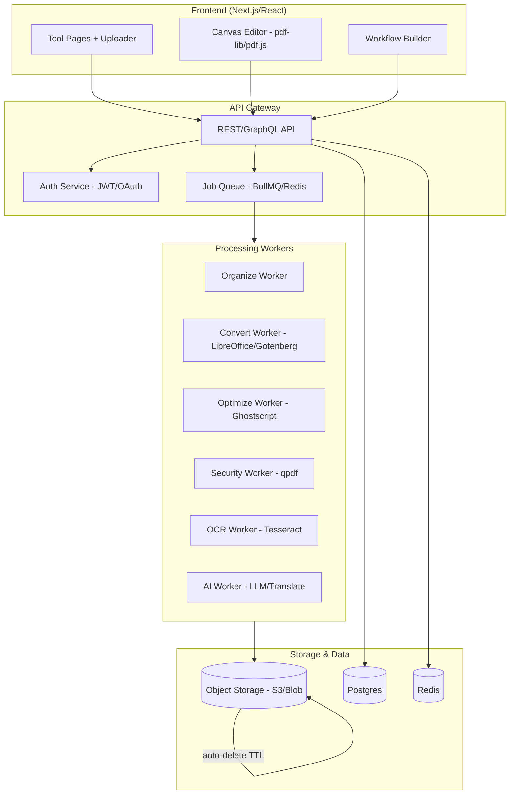

# pdfWala — Complete PDF Toolkit Web App

> A full-featured PDF platform inspired by iLovePDF. Every tool, organized by category, with a step-by-step build plan. **No functionality left behind.**

---

## 1. Product Overview

**pdfWala** is a browser-based PDF toolkit that lets users organize, optimize, convert, edit, secure, and apply AI intelligence to PDF documents — all in one place. It targets individuals, students, and businesses, with free tools plus premium tiers.

> **Companion spec:** [COMPLETE FRD & TECHNICAL ARCHITECTURE.md](COMPLETE%20FRD%20&%20TECHNICAL%20ARCHITECTURE.md) is the authoritative, exhaustive requirements & architecture document (domain model, APIs, entities, security, edge cases, DoD). This file is the **condensed build plan**; where they differ, the FRD governs.

**Core principles**
- 100% browser-first: upload → process → download, no install required.
- Privacy-first: files auto-deleted after processing; encrypted transfer.
- Batch-friendly: most tools accept multiple files at once.
- Cloud-connected: import/export via Google Drive and Dropbox.
- Consistent UX: every tool follows the same 3-step flow — **Select files → Configure options → Process & Download**.

---

## 2. Complete Feature Catalog (34 Tools + Platform Features)

Below is the **full inventory** captured from iLovePDF, grouped into the same six workflow categories. Each tool is a first-class page in pdfWala.

### 2.1 Organize PDF
| # | Tool | Description |
|---|------|-------------|
| 1 | **Merge PDF** | Combine multiple PDFs in a chosen order into one file. |
| 2 | **Split PDF** | Separate one page or a range into independent PDF files. |
| 3 | **Smart Split PDF** *(New)* | AI-assisted splitting that detects logical document boundaries automatically. |
| 4 | **Remove pages** | Delete unwanted pages from a PDF. *(part of Organize)* |
| 5 | **Extract pages** | Pull selected pages into a new PDF. *(part of Organize)* |
| 6 | **Organize PDF** | Sort, reorder, delete, or add pages via drag-and-drop. |
| 7 | **Scan to PDF** | Capture scans from a mobile device and send to the browser. |
| 7b | **Copy PDF** | Duplicate a document (templates, versioning, edit without modifying source). |

> Organize tools also support **password-protected PDF handling** (merge/split/organize protected documents) and **batch processing** of multiple files at once. Split modes include ranges, every-N, extract, individual pages, **by bookmarks**, and Smart Split.

### 2.2 Optimize PDF
| # | Tool | Description |
|---|------|-------------|
| 8 | **Compress PDF** | Reduce file size with multiple levels — **Extreme / Recommended / Less** (quality vs. size). |
| 9 | **Repair PDF** | Recover data from a damaged/corrupt PDF. |
| 10 | **OCR PDF** | Convert scanned PDFs into searchable, selectable text (multi-language). |

### 2.3 Convert PDF
| # | Tool | Description |
|---|------|-------------|
| 11 | **PDF to Word** | Convert PDF into editable DOC/DOCX. |
| 12 | **PDF to PowerPoint** | Convert PDF into editable PPT/PPTX. |
| 13 | **PDF to Excel** | Extract PDF data into XLS/XLSX spreadsheets. |
| 14 | **Word to PDF** | Convert DOC/DOCX to PDF. |
| 15 | **PowerPoint to PDF** | Convert PPT/PPTX to PDF. |
| 16 | **Excel to PDF** | Convert XLS/XLSX to PDF. |
| 17 | **PDF to JPG** | Convert each page to JPG or extract embedded images. |
| 18 | **JPG to PDF** | Convert images to PDF; adjust orientation and margins. |
| 19 | **HTML to PDF** | Convert a webpage URL to PDF. |
| 20 | **PDF to PDF/A** | Convert to ISO-standardized PDF/A for archiving. |
| 21 | **PDF to Markdown** *(New)* | Convert PDFs to Markdown; preserve headings, tables, lists, links. |

### 2.4 Edit PDF
| # | Tool | Description |
|---|------|-------------|
| 22 | **Edit PDF** | Add text, images, shapes, freehand annotations; edit size/font/color. |
| 23 | **Watermark** | Stamp text/image over a PDF; typography, transparency, rotation, position, page selection, logo/corporate watermark. |
| 24 | **Rotate PDF** | Rotate pages; supports batch. |
| 25 | **Page numbers** | Add page numbers — range, position, typography, size, opacity, facing-page numbering. |
| 26 | **Crop PDF** | Crop margins or select areas; apply to one page or all. |
| 27 | **PDF Forms** *(New)* | Detect fields, create interactive fillable PDFs, or fill forms (text, checkbox, multiple-choice, list). |

### 2.5 PDF Security
| # | Tool | Description |
|---|------|-------------|
| 28 | **Unlock PDF** | Remove password security/restrictions from a PDF. |
| 29 | **Protect PDF** | Encrypt/password-protect a PDF to restrict unauthorized access. |
| 30 | **Redact PDF** | Permanently remove sensitive text/graphics (not just a black box). |
| 31 | **Compare PDF** | Side-by-side comparison to spot changes between versions. |

### 2.6 Electronic Signatures (Sign)
> Treated as a **separate product domain** (iLoveSign equivalent), distinct from PDF editing.

| # | Capability | Description |
|---|------------|-------------|
| 32 | **Sign PDF (Self-sign)** | Draw/type/upload a signature and sign your own documents. |
| 32a | **Signature Requests** | Send documents to others to collect signatures. |
| 32b | **Signature Management** | Track and manage signing processes and documents. |
| 32c | **Audit Trail** | Record signer identity, timestamp, IP, and document hash. |
| 32d | **Signed-document Custody** | Securely store and retain completed signed documents. |
| 32e | **Advanced Electronic Signatures (AES)** | Higher-assurance signatures with identity verification (premium tier). |

### 2.7 PDF Intelligence (AI)
| # | Tool | Description |
|---|------|-------------|
| 33 | **AI Summarizer** *(New)* | Generate concise summaries with key points (PDFs, articles, essays). |
| 34 | **Translate PDF** *(New)* | AI translation preserving fonts, layout, formatting. |
| 35 | **Data Extraction** *(New)* | Extract structured data (invoice #, dates, totals, entities) → JSON/XML/CSV/Excel. |
| 36 | **Image Upscale** *(New)* | AI image enhancement to higher resolution. |
| 37 | **Background Removal** *(New)* | Subject segmentation → transparent PNG. |
| — | **PDF to Markdown** | (See Convert #21) AI-oriented extraction for docs, notes, LLM/RAG ingestion. |
| — | **Form Detection** | (See Edit #27) AI layout analysis to suggest fillable fields. |

> AI treats document content as **untrusted data, never instructions** (prompt-injection safe). All AI usage is metered via AI credits.

### 2.8 File Management & Input/Output
| Feature | Description |
|---------|-------------|
| **Upload sources** | Local device, **Google Drive**, **Dropbox**, URL, mobile scan. |
| **Output destinations** | Direct download, or save back to **Google Drive / Dropbox**. |
| **File operations** | Add/remove files, drag-to-reorder, batch operations. |
| **Page thumbnails** | Visual page management across Organize/Edit/Forms. |
| **Temporary-file lifecycle** | Uploaded files auto-deleted after a fixed period (e.g., **2 hours**). |

### 2.9 Platform / Cross-Cutting Features
| Feature | Description |
|---------|-------------|
| **Custom Workflows** | Chain tools (e.g., OCR → extract → compress → watermark → sign → save) as a directed graph; save/version/reuse; triggers, conditional branches, webhook & email nodes. |
| **Batch Processing** | Process many files/documents together; limits scale with plan tier. |
| **Cloud Integration** | Google Drive, Dropbox, **OneDrive/Microsoft** import/export via a provider abstraction. |
| **No-code Integrations** | **Zapier, Make, Power Automate, n8n** triggers/actions. |
| **REST API + Webhooks** | Async job API (`202 Accepted` + jobId), signed HMAC webhooks (`job.*`, `signature.*`, `workflow.*`), API keys/scopes. |
| **Desktop App** | Offline batch processing (compress, merge, split, convert, edit) + watch-folder automation, no limits. |
| **Mobile App** | Full toolset on iOS/Android, camera scan-to-PDF, offline queue, biometric unlock, share-sheet. |
| **Accounts & Auth** | Sign up/in, **MFA**, OAuth, sessions, file history, saved settings and workflows. |
| **Premium/Pricing** | Free, Premium, Business tiers; ads-free, priority support, larger batches/file sizes, AI credits, advanced OCR/e-Sign — modeled as **configurable entitlements**, not hard-coded UI rules. |
| **Security & Trust** | ISO27001-style controls, HTTPS, encryption at rest, malware scanning, auto file deletion. |

### 2.10 Enterprise / Business
| Feature | Description |
|---------|-------------|
| **Team Management** | Create teams, manage users, shared/default actions. |
| **Corporate Branding** | Company logo watermark, standard page-number formats. |
| **SSO** | Single sign-on for organizations. |
| **Regional Processing** | Process documents in a chosen region (data residency). |
| **Admin / Account Management** | Dedicated account management, usage dashboards, roles/permissions. |
| **Custom Contracts & Scale** | Flexible enterprise plans and scalable processing. |
| **MFA & Security Policies** | Org-wide MFA, retention policies, security configuration. |

> **Total: 34 core tool functions + 3 additional AI tools (Data Extract, Upscale, Background Removal) + Copy PDF + 5 signature sub-capabilities**, plus file-management, platform, integration, and enterprise features. Full breakdown in the FRD.

---

## 3. Technical Architecture

**Core design principle** — build around the document lifecycle, not individual buttons:

```text
Tool → Job → Operation → Processing Engine → Result
```

Every tool (Web, Mobile, Desktop, REST API, Workflow, no-code) creates a **Job** with an `operation` + `options`; a shared engine executes it. Domain model: `File → Document → Job → Processing → Result → Workflow`, all scoped to an `Organization` (tenant). Group services by **bounded contexts** (Identity, Organization, Billing, Files, Jobs, Document Processing, Conversion, AI, Forms, Signature, Workflow, Integrations, Notification, Audit) — **not** one microservice per button.



**Recommended stack**
- **Frontend**: Next.js (App Router) + React + TypeScript + Tailwind CSS; `pdf.js` (render), `pdf-lib` (client-side manipulation).
- **Backend**: Node.js (NestJS) or Python (FastAPI); REST + WebSocket for progress.
- **Job queue**: Redis + BullMQ (Node) / Celery (Python).
- **Processing engines**:
  - Merge/Split/Rotate/Crop/Page numbers/Watermark/Organize → `pdf-lib` / `pdftk` / `qpdf`.
  - Compress → Ghostscript.
  - Office ↔ PDF → LibreOffice headless / Gotenberg.
  - HTML → PDF → Puppeteer/Gotenberg (Chromium).
  - OCR → Tesseract / OCRmyPDF.
  - Repair → qpdf / mutool.
  - PDF/A → Ghostscript / veraPDF (validation).
  - Redact → pikepdf + rasterize.
  - Sign → PDF signature libs + certificate handling.
  - AI (Summarize/Translate) → LLM API + translation API.
- **Storage**: S3-compatible object storage with lifecycle TTL (auto-delete).
- **DB**: PostgreSQL (users, jobs, workflows); Redis (cache/sessions).
- **Infra**: Docker + Kubernetes; CDN for static assets.

---

## 4. Step-by-Step Build Plan

Build in phases. Each phase ships something usable. Tools within a phase can be parallelized.

### Phase 0 — Foundations (Setup)
1. Initialize monorepo (frontend + backend + workers) with TypeScript, ESLint, Prettier.
2. Set up Docker Compose (Postgres, Redis, MinIO/S3, LibreOffice, Gotenberg).
3. Scaffold Next.js frontend with Tailwind and a shared component library.
4. Scaffold backend API (NestJS/FastAPI) with health checks and OpenAPI docs.
5. Implement object storage service with signed URLs + auto-delete TTL policy.
6. Implement job queue skeleton (enqueue → worker → status → result).
7. Build the reusable **3-step tool shell**: Uploader → Options panel → Progress → Download.
8. CI/CD pipeline (lint, test, build, deploy) + basic observability (logs/metrics).

### Phase 1 — Organize PDF (fast wins, client-capable)
9. **Merge PDF** — multi-file upload, drag-to-reorder, merge via `pdf-lib`.
10. **Split PDF** — page range/every-N/custom ranges; output as zip.
11. **Smart Split PDF** — AI/heuristic boundary detection (blank pages, headings, barcodes) to auto-split.
12. **Organize PDF** — thumbnail grid, drag-reorder, delete, rotate, insert.
13. **Remove pages** / **Extract pages** — selection UI reusing Organize thumbnails.
14. **Rotate PDF** — per-page and batch rotation.
15. Ship Phase 1 behind the tool shell with progress + download; support protected-PDF unlock prompt.

### Phase 2 — Optimize PDF
16. **Compress PDF** — Ghostscript worker with levels **Extreme / Recommended / Less**.
17. **Repair PDF** — qpdf/mutool recovery worker with best-effort output.
18. **OCR PDF** — OCRmyPDF/Tesseract worker; language selection; searchable output.

### Phase 3 — Convert PDF (highest infra demand)
19. **PDF to JPG** / **JPG to PDF** — pdf.js rasterize / `pdf-lib` assemble; margin & orientation options.
20. **Word/PowerPoint/Excel → PDF** — LibreOffice/Gotenberg workers.
21. **PDF → Word/PowerPoint/Excel** — conversion engine (LibreOffice + layout mapping).
22. **HTML to PDF** — Puppeteer/Gotenberg from URL or pasted HTML.
23. **PDF to PDF/A** — Ghostscript conversion + veraPDF validation.
24. **PDF to Markdown** — text/layout extraction preserving headings, tables, lists, links.

### Phase 4 — Edit PDF (rich client editor)
25. Build the **canvas editor** foundation (pdf.js render + overlay layer, undo/redo).
26. **Edit PDF** — text, image, shapes, freehand; font/size/color controls.
27. **Watermark** — text/image stamp; opacity, rotation, tiling, position, page selection, logo.
28. **Page numbers** — position, format, typography, opacity, start index, facing pages.
29. **Crop PDF** — visual crop box; apply to page/range/all.
30. **PDF Forms** — auto-detect fields, add text/checkbox/radio/list fields, fill & flatten.

### Phase 5 — PDF Security
31. **Protect PDF** — qpdf encryption with user/owner passwords.
32. **Unlock PDF** — remove known password / decrypt.
33. **Redact PDF** — draw redaction boxes, burn-in, strip underlying text.
34. **Compare PDF** — side-by-side diff with visual + text change highlights.

### Phase 6 — Electronic Signatures (separate domain)
35. **Sign PDF (self-sign)** — draw/upload/type signature, place on page, flatten.
36. **Signature Requests** — email invites, signer routing, reminders.
37. **Audit Trail & Custody** — signer identity, timestamp, IP, document hash; secure retention.
38. **Advanced Electronic Signatures (AES)** — identity verification for higher assurance (premium).

### Phase 7 — PDF Intelligence (AI)
39. **AI Summarizer** — extract text → LLM summary with key points; length control; AI-credit metering.
40. **Translate PDF** — extract → translate → reflow preserving fonts/layout; language picker.

### Phase 8 — Platform & Growth
41. **Accounts & Auth** — sign up/in (email + OAuth), file history, saved settings.
42. **Cloud Storage Integration** — Google Drive & Dropbox import/export (OAuth).
43. **Custom Workflows** — visual builder to chain tools; save, reuse, automate.
44. **Batch Processing** — multi-file jobs with per-tier limits.
45. **Pricing & Billing** — Free/Premium/Business tiers; Stripe; quotas & AI credits.
46. **Developer API** — public API + keys + docs (mirror all tools).
47. **Enterprise features** — teams, roles, corporate branding, SSO, regional processing, admin dashboards.
48. **Desktop app** — Electron wrapper for offline batch processing.
49. **Mobile app** — React Native / PWA with scan-to-PDF via camera.
50. **Scan to PDF** — mobile capture → browser handoff (QR/session pairing).

### Phase 9 — Hardening & Launch
51. Security review (OWASP Top 10), rate limiting, per-tenant isolation, malware scan on upload.
52. Job-queue resilience — retries, dead-letter queues, idempotency, autoscale workers.
53. Performance/load testing; quotas & file-size enforcement.
54. Accessibility (WCAG), i18n/localization, SEO for each tool page.
55. Analytics, error tracking, audit logging, and monitoring dashboards.
56. Legal pages (Privacy, Terms, Cookies, Security) + compliance.
57. Beta → public launch.

---

## 5. Tool → Engine Mapping (Quick Reference)

| Tool | Primary Engine | Client/Server |
|------|----------------|---------------|
| Merge / Split / Rotate / Crop / Page numbers / Watermark / Organize | pdf-lib / qpdf | Client + Server |
| Smart Split | pdf-lib + heuristics/ML boundary detection | Server |
| Compress | Ghostscript | Server |
| Repair | qpdf / mutool | Server |
| OCR | OCRmyPDF / Tesseract | Server |
| Office ↔ PDF | LibreOffice / Gotenberg | Server |
| HTML → PDF | Puppeteer / Gotenberg | Server |
| PDF/A | Ghostscript + veraPDF | Server |
| PDF → JPG / JPG → PDF | pdf.js / pdf-lib | Client + Server |
| PDF → Markdown | Text/layout extractor | Server |
| Edit / Forms | pdf.js + pdf-lib | Client |
| Protect / Unlock | qpdf | Server |
| Redact | pikepdf + raster | Server |
| Compare | diff + render | Server |
| Sign | signature libs | Client + Server |
| Summarize / Translate | LLM + translation API | Server |
| Cloud import/export | Google Drive / Dropbox SDKs (OAuth) | Server |

---

## 6. Data & Privacy Model

- Uploaded files stored in object storage with a short TTL (e.g., 2 hours) then auto-deleted.
- Processing jobs reference files by signed URL; workers never persist beyond job scope.
- All transfers over HTTPS; encryption at rest for stored blobs.
- No file content used for training; explicit opt-in for any AI feature logging.
- Audit trail for Sign PDF (who signed, when, IP, document hash).

---

## 7. Non-Functional & Production Requirements

These underpin every tool and are required for a production-grade platform (easy to miss in a feature list):

| Area | Requirement |
|------|-------------|
| **Quotas & limits** | Per-tier file-size caps, daily job limits, concurrent-job limits, page limits. |
| **AI credits** | Metered credits for Summarize/Translate/Smart Split; balance + top-up. |
| **Job queue** | Async workers with retries, backoff, dead-letter queue, idempotency keys. |
| **Rate limiting** | Per-IP and per-account throttling; abuse detection. |
| **Malware scanning** | Virus/malware scan on every upload before processing. |
| **Temp-file lifecycle** | Enforced TTL cleanup; no orphaned blobs. |
| **Multi-tenancy** | Tenant isolation for Business/Enterprise data and workflows. |
| **Encryption** | TLS in transit, AES-256 at rest, secrets in a vault. |
| **Audit logging** | Immutable logs for signatures, admin actions, and data access. |
| **Observability** | Metrics, tracing, structured logs, alerting, health checks. |
| **Autoscaling** | Worker pools scale by queue depth; region-aware processing. |
| **Compliance** | GDPR/data-residency, ISO27001-style controls, DPA for business. |

---

## 8. Milestone Summary

| Milestone | Deliverable | Tools Delivered |
|-----------|-------------|-----------------|
| M0 | Foundations + tool shell | Infra only |
| M1 | Organize suite live | 7 |
| M2 | Optimize suite live | 3 |
| M3 | Convert suite live | 11 |
| M4 | Edit suite + editor | 6 |
| M5 | Security suite live | 4 |
| M6 | E-signature domain live | Sign + AES |
| M7 | AI intelligence live | 2 |
| M8 | Cloud, accounts, workflows, billing, API, enterprise, apps | Platform |
| M9 | Hardening + public launch | — |

**All 34 tool functions + signature sub-capabilities + file-management, platform, enterprise, and non-functional layers are covered. Nothing left behind.**

---

## 9. Definition of Done (per tool)

A tool is **not** complete just because it produces a PDF. Each tool ships with: frontend screen, upload + entitlement validation, backend API, async job (queue + worker), progress, cancellation/retry, stable error codes, output validation, storage + download + expiration, audit, metrics, and tests (unit, integration, E2E, large-file, malformed-file, multilingual where relevant). See FRD §128 for the full checklist.

> Build sequence per the FRD: Identity → File Service → Job Service → Queue → PDF Worker → Object Storage, then Conversion, then AI/Signatures. Do not start with AI or signatures.
